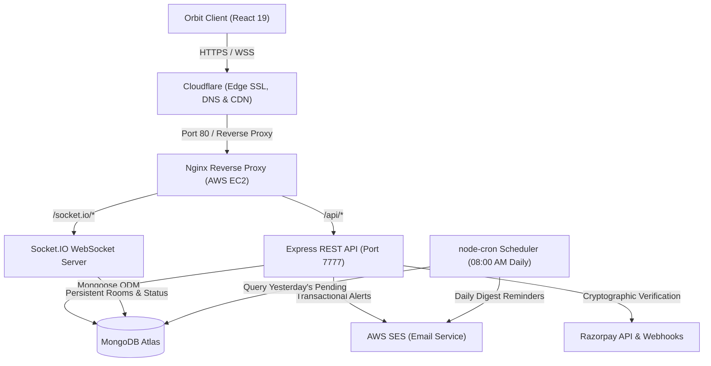
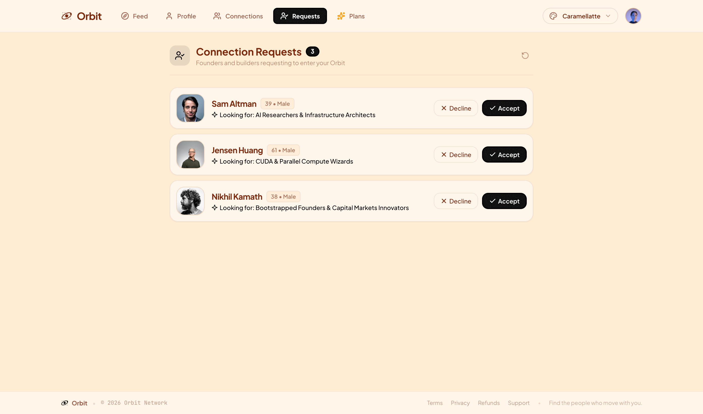
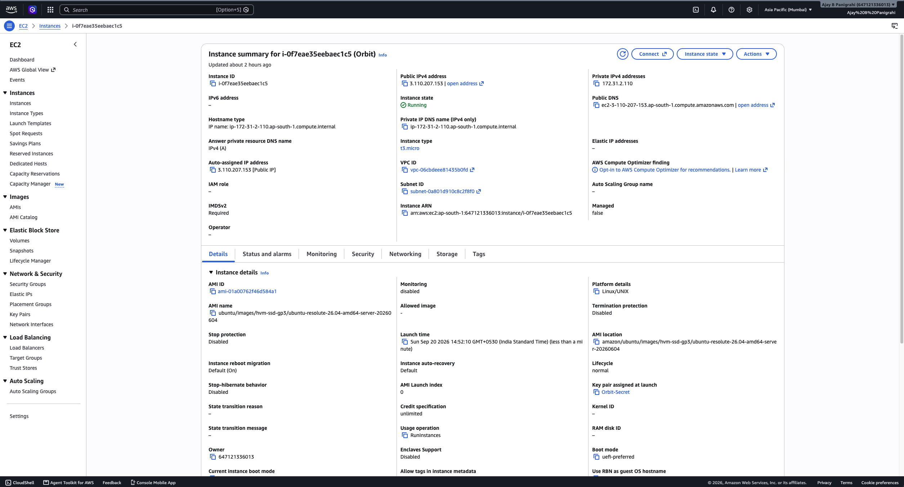
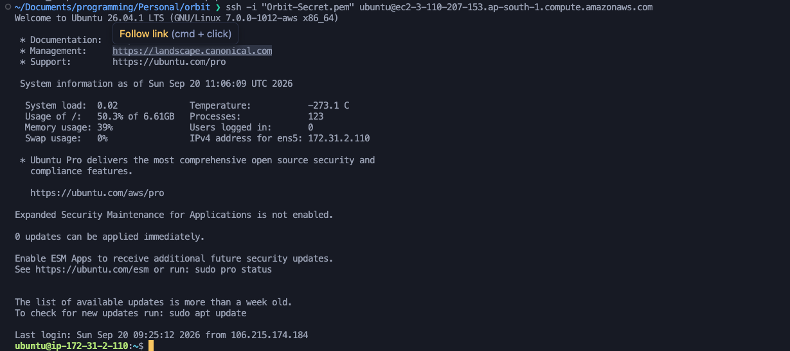
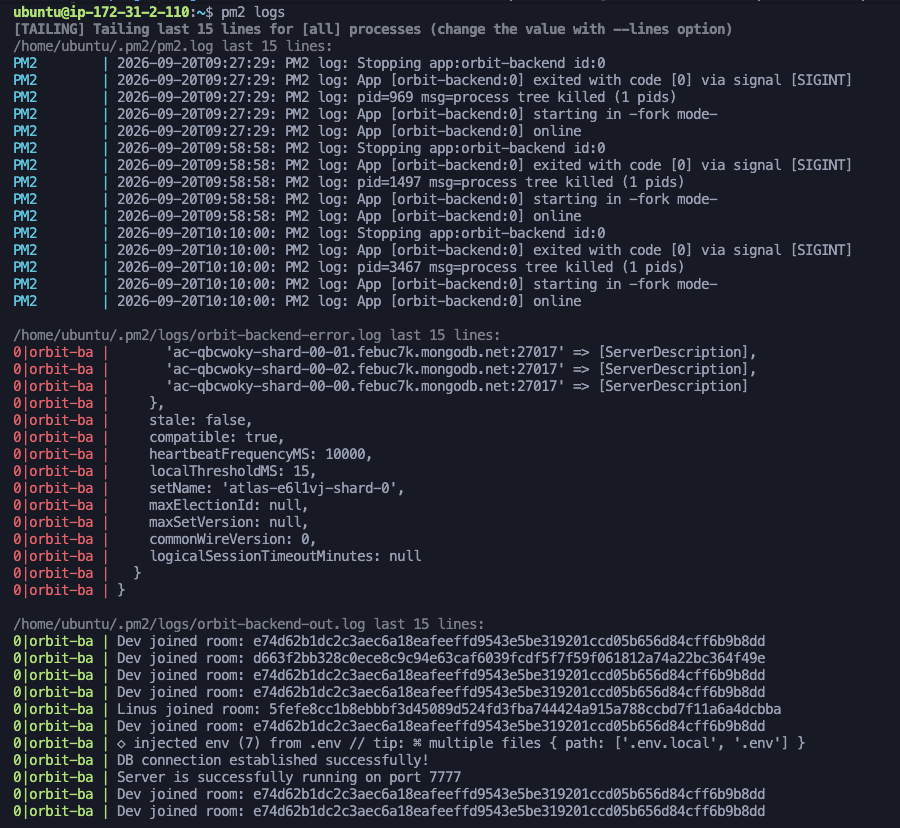
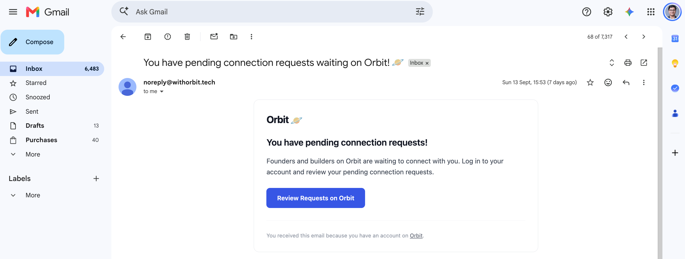

# Orbit | Backend API & Real-Time Engine

Production-ready REST API, WebSockets messaging engine, automated cron scheduler, and subscription billing infrastructure powering the Orbit platform.

---

## Live Deployment

- **Production URL:** [https://withorbit.tech/](https://withorbit.tech/)
- **Base API Endpoint:** `https://withorbit.tech/api`

> [!NOTE]
> **Production Deployment & Cloud Hosting Notice**
> The complete production stack was initially provisioned, battle-tested, and verified on bare-metal **AWS Cloud Infrastructure (AWS EC2 Ubuntu, Nginx reverse proxy, PM2 daemon, AWS SES, and Cloudflare edge SSL)**.
> 
> To optimize personal AWS compute credits while maintaining 100% 24/7 uptime for recruiters and peers, the active production deployment is hosted on **Render** (Backend) and **Vercel** (Frontend), with MongoDB Atlas and AWS SES operating continuously. Both deployment topologies share the exact same codebase, domain ([withorbit.tech](https://withorbit.tech/)), and architecture.

---

## System Architecture



---

## Interface & DevOps Walkthrough

### 1. Feed Matchmaking & Profile Discovery
Paginated discovery pipeline serving eligible builder cards while excluding self, existing connections, sent requests, and ignored profiles.


---

### 2. Connection Lifecycle Management
Structured two-way request handling with atomic database mutations for `interested`, `accepted`, `rejected`, and `ignored` statuses.



---

### 3. Mutual Connections Directory
Indexed lookup for confirmed connections, exposing endpoints to initiate direct real-time communication channels.


---

### 4. Razorpay Subscription & Webhook Processing
Server-side order generation and cryptographic HMAC-SHA256 signature verification for tiered subscription upgrades.


---

### 5. AWS EC2 Cloud Infrastructure
Production virtual machine provisioned on AWS EC2 (`t3.micro`, Ubuntu, region `ap-south-1`) with network security group ingress configuration.



---

### 6. SSH Terminal Access & Server Administration
Direct SSH terminal access with keypair validation, system performance monitoring, and production environment maintenance.



---

### 7. PM2 Process Supervision & Real-Time Socket Logging
PM2 daemon managing `orbit-backend` with zero-downtime reloads, automatic crash recovery, and real-time Socket.IO room lifecycle logging.



---

### 8. Automated Daily Cron Worker & AWS SES Delivery
Background worker scheduled via `node-cron` running daily at **08:00 AM IST** (`0 8 * * *`), querying unreviewed requests and dispatching digests via **AWS SES**.



---

## Technical Architecture

- **Modular Express 5 Pipeline:** Structured micro-engine architecture featuring route isolation, asynchronous error boundaries, and centralized middleware dispatch.
- **Normalized MongoDB Data Modeling:** Optimized Mongoose schemas with compound indexes (`[senderId, receiverId, status]`) for sub-25ms feed exclusion queries.
- **Stateful WebSocket Cluster Management:** Socket.IO server orchestrating dynamic peer-to-peer room routing, presence tracking, and broadcast events with cookie-based handshake validation.
- **Automated Cron Digest Worker:** `node-cron` daemon executing daily at 08:00 AM IST (`0 8 * * *`), isolating previous 24h pending connection requests with batch deduplication.
- **Transactional Email Pipeline with AWS SES:** Direct integration with AWS Simple Email Service SDK for high-deliverability templated transactional alerts and digests.
- **Cryptographic Webhook Verification:** HMAC-SHA256 signature verification comparing payload digests to secure payment callbacks and guarantee transaction idempotency.
- **Stateless JWT Session Management:** Signed, HTTP-only, SameSite cookies with bcrypt salt rounds, eliminating CSRF and credential theft risks.
- **Nginx Reverse Proxy & Duplex Streaming:** Tailored Nginx reverse proxy mapping `$http_upgrade` to `$connection_upgrade` with extended 24-hour timeout allocations.

---

## Key Engineering Challenges & Solutions

- **Nginx Reverse Proxying for Cloudflare-Terminated WebSockets:** Configured Nginx with dynamic HTTP upgrade maps (`map $http_upgrade $connection_upgrade`) and 86400s timeouts to prevent premature socket termination through Cloudflare.
- **High-Performance Compound Feed Matchmaking Query:** Replaced multi-query lookups with an indexed `$nin` aggregation query filtering self, connections, pending requests, and ignored profiles in a single roundtrip.
- **Payment Signature Verification & Replay Protection:** Enforced cryptographic HMAC-SHA256 digest validation comparing computed hash against Razorpay headers before committing database mutations.
- **Resilient Background Task Scheduling & Batch Emailing:** Isolated daily cron worker in a separate execution context with try/catch boundaries to prevent unhandled promise rejections from halting the main process.
- **Cookie Security across Proxied Cloud Architectures:** Configured cross-origin cookie options (`HttpOnly`, `SameSite`, `domain`, `Secure`) and Nginx `X-Forwarded-Proto` forwarding to maintain session persistence behind Cloudflare.

---

## Multi-Cloud Portability & Infrastructure Governance

- **DevOps Validation:** The production stack was initially deployed and validated directly on **AWS EC2 with custom Nginx reverse proxying, PM2, and Cloudflare**.
- **Credit & Cost Optimization:** Because dedicated cloud compute credits are finite, the backend was architected to be completely cloud-agnostic. The containerized Express server can transition seamlessly to **Render, Fly.io, or Railway** while MongoDB Atlas, Razorpay, and AWS SES remain independent external services, requiring zero application-level refactoring.

---

## API Reference

| Method | Endpoint | Description | Auth Required |
| :--- | :--- | :--- | :--- |
| `POST` | `/api/signup` | Register a new user account | No |
| `POST` | `/api/login` | Authenticate user & issue HTTP-only JWT cookie | No |
| `POST` | `/api/logout` | Clear authentication cookie | Yes |
| `GET` | `/api/profile/view` | Retrieve authenticated user profile | Yes |
| `PATCH` | `/api/profile/edit` | Update user profile data & technical skills | Yes |
| `GET` | `/api/user/feed` | Retrieve discoverable developer profiles (paginated) | Yes |
| `GET` | `/api/user/connections` | Retrieve list of accepted connections | Yes |
| `GET` | `/api/user/requests/received` | Retrieve pending incoming connection requests | Yes |
| `POST` | `/api/request/send/:status/:toUserId` | Dispatch connection request (`interested` / `ignored`) | Yes |
| `POST` | `/api/request/review/:status/:requestId` | Accept or reject an incoming request | Yes |
| `GET` | `/api/chat/:targetUserId` | Retrieve paginated chat history between two users | Yes |
| `POST` | `/api/payment/create` | Initialize Razorpay order with tier metadata | Yes |
| `POST` | `/api/payment/webhook` | Process verified payment webhooks & upgrade tier | Secret Verified |

---

## Tech Stack

- **Runtime:** Node.js (v20+)
- **Framework:** Express 5
- **Database & ODM:** MongoDB Atlas, Mongoose
- **Real-Time Engine:** Socket.IO
- **Task Scheduling:** node-cron, date-fns
- **Cloud Infrastructure:** AWS EC2 (Ubuntu), AWS SES, Cloudflare
- **Process Supervision:** PM2
- **Web Server & Reverse Proxy:** Nginx
- **Payment Processing:** Razorpay Node SDK
- **Security:** JSON Web Tokens, bcrypt, cookie-parser, cors, validator

---

## Local Development Setup

### 1. Clone the repository
```bash
git clone https://github.com/the-ajay-panigrahi/orbit-backend.git
cd orbit-backend
```

### 2. Install dependencies
```bash
npm install
```

### 3. Environment Variables
Create a `.env` file in the project root:
```env
PORT=7777
MONGODB_URI="mongodb+srv://<username>:<password>@cluster.mongodb.net/orbit"
JWT_SECRET_KEY="your_secure_jwt_secret"
AWS_ACCESS_KEY="your_aws_ses_access_key"
AWS_SECRET_KEY="your_aws_ses_secret_key"
RAZORPAY_KEY_ID="your_razorpay_key_id"
RAZORPAY_KEY_SECRET="your_razorpay_key_secret"
RAZORPAY_WEBHOOK_SECRET="your_razorpay_webhook_secret"
```

### 4. Seed Database (Optional)
```bash
npm run seed
```

### 5. Run Server
```bash
# Development mode with Nodemon
npm run dev

# Production mode
npm start
```

---

## Author

**Ajay Panigrahi**
- Website: [https://withorbit.tech](https://withorbit.tech)
- GitHub: [@the-ajay-panigrahi](https://github.com/the-ajay-panigrahi)
- LinkedIn: [Ajay Panigrahi](https://www.linkedin.com/in/ajay-panigrahi/)
