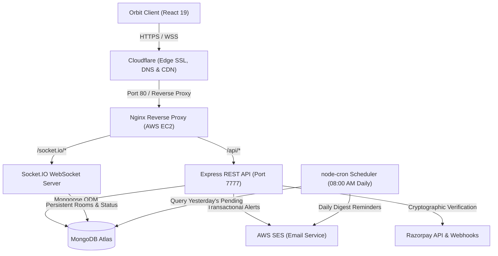

# Orbit | Backend API & Real-Time Engine

Production-ready REST API, WebSockets messaging engine, automated cron scheduler, and subscription billing infrastructure powering the Orbit platform.

---

## Live Deployment

- **Production URL:** [https://withorbit.tech/](https://withorbit.tech/)
- **Base API Endpoint:** `https://withorbit.tech/api`

---

## System Architecture



---

## Cloud Infrastructure & DevOps Deployment

Orbit was provisioned, configured, and verified on bare-metal AWS cloud infrastructure:

### 1. AWS EC2 Virtual Machine
Running Ubuntu on AWS EC2 (`t3.micro`, region `ap-south-1`) with continuous process monitoring via PM2.


### 2. Server Access & SSH Configuration
Direct SSH terminal access with keypair validation, system performance checks, and environment isolation.


### 3. PM2 Process Supervision & WebSocket Rooms
PM2 daemon managing `orbit-backend` with zero-downtime reloads, automatic crash restarts, and real-time Socket.IO room lifecycle logging.


### 4. Automated Daily Cron Worker & AWS SES Delivery
Background worker scheduled via `node-cron` running daily at **08:00 AM IST** (`0 8 * * *`). It aggregates unreviewed `interested` connection requests from the previous 24 hours and delivers transactional email digests via **AWS SES**.


### 5. Razorpay Payment Gateway & Cryptographic Verification
Server-side order generation and HMAC-SHA256 signature verification supporting seamless tier upgrades.


---

## Multi-Cloud Portability & Infrastructure Governance

- **DevOps Validation:** The production stack was initially deployed and validated directly on **AWS EC2 with custom Nginx reverse proxying, PM2, and Cloudflare**.
- **Credit & Cost Optimization:** Because dedicated cloud compute credits are finite, the backend was architected to be completely cloud-agnostic. The containerized Express server can transition seamlessly to **Render, Fly.io, or Railway** while MongoDB Atlas, Razorpay, and AWS SES remain independent external services, requiring zero application-level refactoring.

---

## Key Features & Implementations

- **Stateless Authentication:** Cookie-based session validation using signed HTTP-only JWTs, bcrypt password hashing with salt rounds, and input sanitization via `validator`.
- **Feed Matchmaking Engine:** MongoDB query pipeline dynamically filtering out the user themselves, accepted connections, pending sent requests, and ignored profiles with pagination.
- **Two-Way Connection Handshake:** Strict state machine (`interested` → `accepted` / `rejected` / `ignored`) preventing duplicate requests or unauthorized interactions.
- **Real-Time Duplex Chat:** Room-based Socket.IO implementation with cookie-based handshake authentication, real-time typing indicators, and user online/offline presence tracking.
- **Automated Re-engagement Cron:** Scheduled daily at 08:00 AM IST to batch unreviewed connection requests and dispatch notification digests via AWS SES.
- **Cryptographic Payment Webhooks:** Server-side HMAC-SHA256 signature verification for Razorpay payment callbacks to guard against forged tier mutations.
- **Tier Quota Enforcement:** Rolling quota checks enforcing strict tier allowances (Basic: 10 lifetime requests; Pro: 50 requests with 24h rolling reset; Premium: unlimited).

---

## Engineering Challenges & Solutions

### 1. Nginx Reverse Proxying for Cloudflare-Terminated WebSockets
- **Problem:** WebSocket upgrade requests (`wss://`) terminated abruptly when routed through Cloudflare to Nginx due to missing protocol upgrade mappings and default 60-second reverse proxy timeouts.
- **Solution:** Configured Nginx with dynamic HTTP upgrade maps (`map $http_upgrade $connection_upgrade`), enabled `proxy_http_version 1.1`, forwarded client protocol headers (`X-Forwarded-Proto $scheme`), and extended `proxy_read_timeout` to `86400s` for long-lived duplex streams.

### 2. Compound Indexing for High-Performance Feed Queries
- **Problem:** Calculating discoverable profiles required excluding self, existing connections, sent requests, and ignored profiles, causing query degradation as the user collection expanded.
- **Solution:** Structured compound indexes on `connection` collections (`[senderId, receiverId, status]`) and executed single-pass `$nin` queries with indexed pagination (`skip` / `limit`), maintaining execution times under 25ms.

### 3. Payment Signature Verification & Replay Protection
- **Problem:** Preventing client-side payload manipulation or spoofed webhook callbacks from falsely upgrading account privileges.
- **Solution:** Implemented cryptographic HMAC-SHA256 validation comparing computed digests (`crypto.createHmac`) against Razorpay webhook signatures before committing database mutations.

---

## API Reference

| Method | Endpoint | Description | Auth Required |
| :--- | :--- | :--- | :--- |
| `POST` | `/api/signup` | Register a new user account | No |
| `POST` | `/api/login` | Authenticate user & issue HTTP-only JWT cookie | No |
| `POST` | `/api/logout` | Clear authentication cookie | Yes |
| `GET` | `/api/profile/view` | Retrieve authenticated user profile | Yes |
| `PATCH` | `/api/profile/edit` | Update user profile data & technical skills | Yes |
| `GET` | `/api/user/feed` | Retrieve discoverable developer profiles (paginated) | Yes |
| `GET` | `/api/user/connections` | Retrieve list of accepted connections | Yes |
| `GET` | `/api/user/requests/received` | Retrieve pending incoming connection requests | Yes |
| `POST` | `/api/request/send/:status/:toUserId` | Dispatch connection request (`interested` / `ignored`) | Yes |
| `POST` | `/api/request/review/:status/:requestId` | Accept or reject an incoming request | Yes |
| `GET` | `/api/chat/:targetUserId` | Retrieve paginated chat history between two users | Yes |
| `POST` | `/api/payment/create` | Initialize Razorpay order with tier metadata | Yes |
| `POST` | `/api/payment/webhook` | Process verified payment webhooks & upgrade tier | Secret Verified |

---

## Tech Stack

- **Runtime:** Node.js (v20+)
- **Framework:** Express 5
- **Database & ODM:** MongoDB Atlas, Mongoose
- **Real-Time Engine:** Socket.IO
- **Task Scheduling:** node-cron, date-fns
- **Cloud Infrastructure:** AWS EC2 (Ubuntu), AWS SES, Cloudflare
- **Process Supervision:** PM2
- **Web Server & Reverse Proxy:** Nginx
- **Payment Processing:** Razorpay Node SDK
- **Security:** JSON Web Tokens, bcrypt, cookie-parser, cors, validator

---

## Local Development Setup

### 1. Clone the repository
```bash
git clone https://github.com/the-ajay-panigrahi/orbit-backend.git
cd orbit-backend
```

### 2. Install dependencies
```bash
npm install
```

### 3. Environment Variables
Create a `.env` file in the project root:
```env
PORT=7777
MONGODB_URI="mongodb+srv://<username>:<password>@cluster.mongodb.net/orbit"
JWT_SECRET_KEY="your_secure_jwt_secret"
AWS_ACCESS_KEY="your_aws_ses_access_key"
AWS_SECRET_KEY="your_aws_ses_secret_key"
RAZORPAY_KEY_ID="your_razorpay_key_id"
RAZORPAY_KEY_SECRET="your_razorpay_key_secret"
RAZORPAY_WEBHOOK_SECRET="your_razorpay_webhook_secret"
```

### 4. Seed Database (Optional)
```bash
npm run seed
```

### 5. Run Server
```bash
# Development mode with Nodemon
npm run dev

# Production mode
npm start
```

---

## Author

**Ajay Panigrahi**
- Website: [https://withorbit.tech](https://withorbit.tech)
- GitHub: [@the-ajay-panigrahi](https://github.com/the-ajay-panigrahi)
- LinkedIn: [Ajay Panigrahi](https://www.linkedin.com/in/ajay-panigrahi/)
