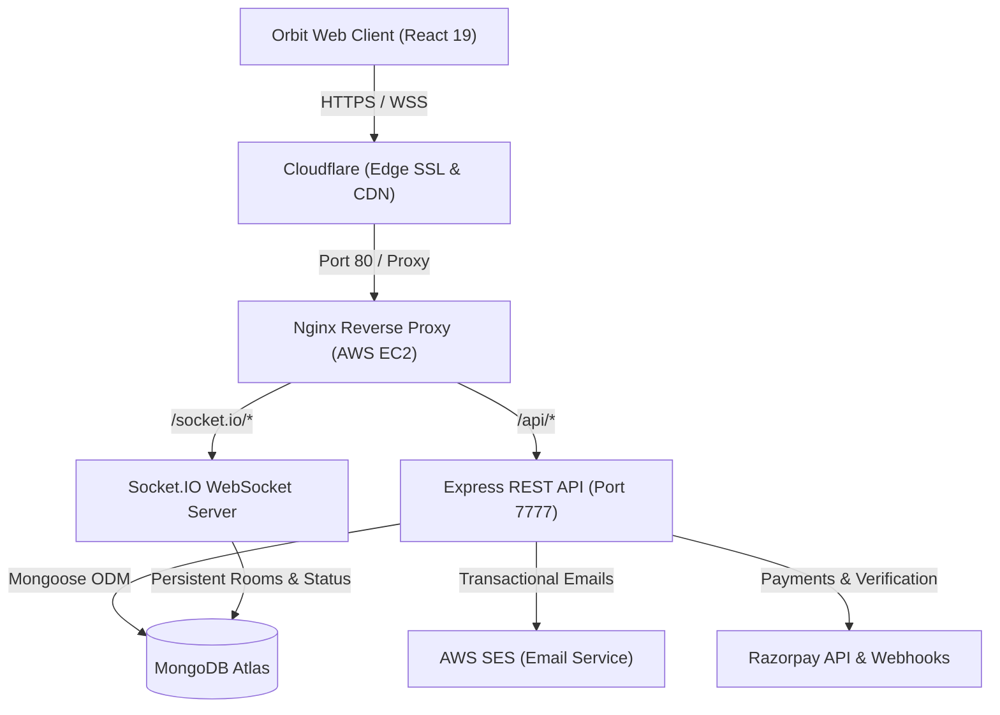

# Orbit — Backend API & Real-Time Engine

**Scalable REST API, WebSockets engine, and payment infrastructure powering the Orbit platform.**

The Orbit Backend is an event-driven, production-ready server built with **Node.js**, **Express**, **MongoDB Atlas**, **Socket.IO**, **AWS SES**, and **Razorpay**. It handles developer authentication, matchmaking algorithms, real-time 1-on-1 messaging, transactional notifications, and automated subscription billing.

---

## 🚀 Live Link

**Production Application →** [https://withorbit.tech/](https://withorbit.tech/)  
**Base API Endpoint →** `https://withorbit.tech/api`

---

## 🖼️ System Architecture



---

## 🔧 Features

- **Robust Authentication & Security:** Cookie-based session management using signed HTTP-only JWTs, bcrypt password hashing with salt rounds, and input sanitization.
- **Matchmaking & Discovery Pipeline:** Efficient discovery query that dynamically filters out existing connections, pending requests, and already reviewed profiles while enforcing membership quota rules.
- **2-Way Connection Handshake System:** Structured connection statuses (`interested`, `ignored`, `accepted`, `rejected`) preventing duplicate or unauthorized interaction requests.
- **Real-Time WebSocket Messaging:** Room-based real-time communication via **Socket.IO**, supporting real-time delivery, online/offline presence tracking, and typing broadcast events.
- **Tiered Subscriptions & Webhook Processing:** Cryptographic payment order creation and webhook verification with **Razorpay**, automating member tier upgrades (Free, Pro, Premium).
- **Transactional Notifications with AWS SES:** Instant email dispatch via Amazon Simple Email Service notifying users when they receive a connection request or match.
- **Rolling Quota Enforcement:** Tier-based daily request reset engine managing free allowances (10 lifetime requests for Basic, 50 daily for Pro, unlimited for Premium).

---

## 💡 Why I Built This

I designed the Orbit backend to be a dependable, secure, and production-grade backend engine capable of handling real-time data synchronization and financial transactions with zero downtime.

Rather than relying on plug-and-play backend-as-a-service platforms, I built this from scratch to demonstrate complete mastery over backend system architecture: designing normalized Mongoose data models, configuring resilient Nginx reverse proxies on AWS EC2, managing WebSocket connection protocols behind Cloudflare SSL, and implementing secure payment verification pipelines.

---

## 🧱 Challenges & Lessons

### 1. Nginx Reverse Proxying for Cloudflare-Terminated WebSockets
- **The Challenge:** When deploying behind Cloudflare with SSL termination, WebSocket upgrade requests (`wss://`) initially closed before establishing due to mismatched connection upgrade headers and standard 60-second reverse proxy timeouts.
- **How I Tackled It:** Configured Nginx with dynamic HTTP upgrade maps (`map $http_upgrade $connection_upgrade`), enabled `proxy_http_version 1.1`, forwarded client protocol headers (`X-Forwarded-Proto $scheme`), and extended `proxy_read_timeout` to `86400s` to maintain long-lived duplex socket streams.

### 2. Complex Compound Feed Queries & Matchmaking Performance
- **The Challenge:** As user numbers grow, calculating available feed profiles requires querying users while excluding: self, all accepted connections, pending sent requests, and ignored profiles without full collection scans.
- **How I Tackled It:** Structured compound MongoDB indexes on `connection` collections (`[senderId, receiverId, status]`) and built indexed `$nin` exclusion queries with server-side pagination (`skip` / `limit`), keeping query execution under 25ms.

### 3. Cryptographic Payment Verification with Razorpay
- **The Challenge:** Preventing replay attacks and forged membership upgrade requests from fraudulent client-side requests.
- **How I Tackled It:** Implemented strict HMAC-SHA256 signature verification comparing `crypto.createHmac("sha256", secret)` against Razorpay's generated signatures before executing database mutations and upgrading membership tiers.

---

## 🧠 What I Learned

- Designing secure, production-hardened RESTful architectures using **Express 5** and **Node.js**.
- Managing distributed state and room lifecycles using **Socket.IO** with custom cookie-based handshake authentication.
- Deploying and configuring Linux servers on **AWS EC2** with **Nginx** reverse proxying, **PM2** process management, and **Cloudflare** SSL orchestration.
- Integrating external enterprise APIs including **Amazon SES** and **Razorpay** payment gateways.
- Advanced schema validation, data modeling, and lifecycle hooks with **Mongoose**.

---

## 🗂️ Tech Stack

- **Runtime Environment:** [Node.js](https://nodejs.org/) (v20+)
- **Web Framework:** [Express 5](https://expressjs.com/)
- **Database & ODM:** [MongoDB Atlas](https://www.mongodb.com/atlas), [Mongoose](https://mongoosejs.com/)
- **Real-Time Engine:** [Socket.IO](https://socket.io/)
- **Cloud Infrastructure:** [AWS EC2 (Ubuntu)](https://aws.amazon.com/ec2/), [AWS SES](https://aws.amazon.com/ses/), [Cloudflare](https://www.cloudflare.com/)
- **Process Management & Proxy:** [PM2](https://pm2.keymetrics.io/), [Nginx](https://nginx.org/)
- **Payment Processing:** [Razorpay Node SDK](https://razorpay.com/)
- **Authentication & Security:** JSON Web Tokens (`jsonwebtoken`), `bcrypt`, `cookie-parser`, `cors`

---

## 📡 Key API Endpoints

| Method | Endpoint | Description | Auth Required |
| :--- | :--- | :--- | :--- |
| `POST` | `/api/signup` | Register a new user account | No |
| `POST` | `/api/login` | Authenticate user & set JWT cookie | No |
| `POST` | `/api/logout` | Clear auth cookie | Yes |
| `GET` | `/api/profile/view` | Fetch current logged-in user profile | Yes |
| `PATCH` | `/api/profile/edit` | Update user profile data & skills | Yes |
| `GET` | `/api/user/feed` | Fetch discoverable developer profiles | Yes |
| `GET` | `/api/user/connections` | Fetch accepted connections | Yes |
| `GET` | `/api/user/requests/received` | Fetch pending incoming connection requests | Yes |
| `POST` | `/api/request/send/:status/:toUserId` | Send connection request (`interested` / `ignored`) | Yes |
| `POST` | `/api/request/review/:status/:requestId`| Accept or reject connection request | Yes |
| `GET` | `/api/chat/:targetUserId` | Fetch paginated chat history between two users | Yes |
| `POST` | `/api/payment/create` | Create a Razorpay checkout order | Yes |
| `POST` | `/api/payment/webhook` | Handle verified payment webhooks & upgrade membership | Verified Secret |

---

## 📁 Project Setup

### 1. Clone the repository
```bash
git clone https://github.com/the-ajay-panigrahi/orbit-backend.git
cd orbit-backend
```

### 2. Install dependencies
```bash
npm install
```

### 3. Configure environment variables
Create a `.env` file in the root directory:
```env
PORT=7777
MONGODB_URI="mongodb+srv://<username>:<password>@cluster.mongodb.net/orbit"
JWT_SECRET_KEY="your_secure_jwt_secret"
AWS_ACCESS_KEY="your_aws_ses_access_key"
AWS_SECRET_KEY="your_aws_ses_secret_key"
RAZORPAY_KEY_ID="your_razorpay_key_id"
RAZORPAY_KEY_SECRET="your_razorpay_key_secret"
RAZORPAY_WEBHOOK_SECRET="your_razorpay_webhook_secret"
```

### 4. Seed sample builder profiles (Optional)
```bash
npm run seed
```

### 5. Run the server
```bash
# Development mode with Nodemon
npm run dev

# Production mode
npm start
```

---

## 👨‍💻 Author

**Ajay Panigrahi**
- Website: [https://withorbit.tech](https://withorbit.tech)
- GitHub: [@the-ajay-panigrahi](https://github.com/the-ajay-panigrahi)
- LinkedIn: [Ajay Panigrahi](https://www.linkedin.com/in/theajaypanigrahi/)
